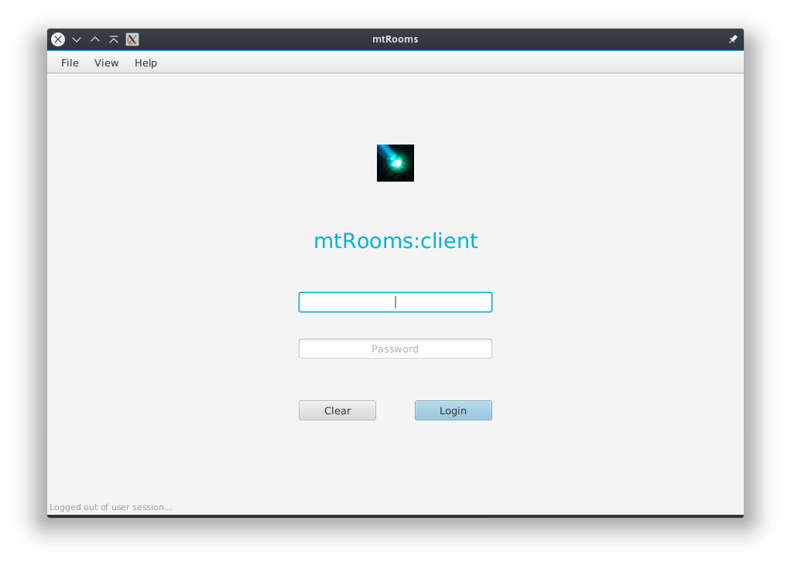

# mtRooms

## Description

mtRooms is a java based desktop/LAN room booking software that uses RMI for client-server communication.

__Note:__ _Under development_

- [ ] Frontend (client/UI)
    -  [x] Administration
    -  [ ] Reservation
        -  [ ] Client account
        -  [ ] Room Booking
    - [ ] Revenue
    - [x] Logistics
- [x] Backend (server)

## Requirements

- Java 8 runtime environment (preferably Open JRE but Oracle JRE should work as well).

## Installation

//TODO

## Usage

Launch the server then the client (first login with started account is u/n: *root*, pwd: *letmein*).

//TODO

## Links

Project [wiki](https://github.com/BBKbeam/mtRooms/wiki) (Technical overview documentation)

//TODO

## License

.

mtRooms is released under the [GNU General Public License v3](https://www.gnu.org/licenses/gpl-3.0.en.html)